# Rust key ideas

## 1 References are always valid. No danglig pointers

- When reference goes out of scope it is no longer valid. You'll get a compiler error.

## 2 Mutable references are `UNIQUE`. No Mutable aliasing

- If we take in `&mut T` that has to be the **ONLY** Reference to that object while it's alive!

- We cant have `&mut` (exclusive) and the `&` (shared) reference to the same object **AT THE SAME TIME** either.

- In contrast `C++` Allows mutable aliasing.

---

### 1 References are always valid

#### A dangling pointer

```rust  
let my_int_ptr: &132;
{
   let my_int: 132 = 5;
   my_int_ptr = &my_int;
}
dbg! (*my_int_ptr);
```

- Compiler Error `my_int` does not live long enough...
- When we deref `*my_int_ptr` in dbg!(). Which references `my_int` that left the scope one line above.

#### A borrowing view

```rust
let my_string: String =
"abcdefghijklmnopqrstuvwxy". to_string();
let my_string_view: &str = (my_string + "z"). as_str();
dbg! (my_string_view);
```

- Compiler Error : Temporary value dropped while borrowed. </br> Temporary value is freed at the end of this statement `(my_string + "z"). as_str()`

- In short `String` is heap allocated []chars , while `&str` (string view) is pointer to chars on the heap (refers to string on the heap).

- C++ would throw ASAN Error here.
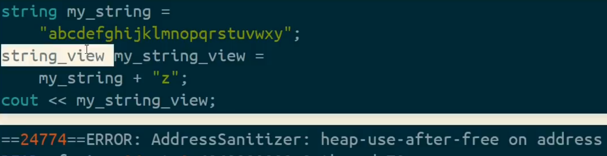

#### A long lived container

```rust
let mut my_vector: Vec<&str> = Vec: :new();
{
   let my_string = "hello world". to_string();
   my_vector push(&my_string);
}
dbg! (my_vector );
```

- Compiler Error : borrowed value does not live long enough.</br>
`my_string` does not live long enough. `&` acts as deref coersion and implicitly converts string to &str (str view).

- C++ Throws ASAN arror for this too.
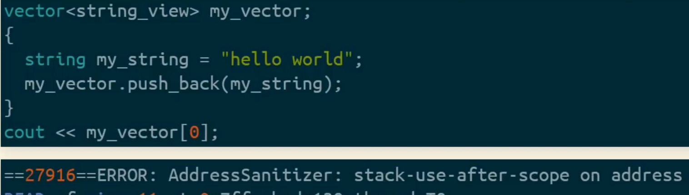
We get `stack use after free` instead of `heap...` as in previous errors because c++ does `small string optimization` for short strings like `hello world`. (fits into stack size of String class).

#### An invalid function

```rust
fn my_push_back(v: &mut Vec<&str>, s: &str) {
   v. push(s) ;
}
fn main() {
{
   let mut my_vector: Vec<&str> = Vec:: new();
   let my_string = "hello world". to_string();
   my_push_back(&mut my_vector, &my_string);
}
   dbg! (my_vector);
}
```

- Compiler Error : `lifetime` missmatch </br>
data flows from `s` into `v` here. (says we're trying to take our &str `s` and insert it into the `&mut Vec<T>` `v`)

- Error is thrown from `fn my_push_back` because compiler saw the signature.

- Rust looks borow checker rules of `fn my_push_back` in isolation (all by itself).

- C++ throws
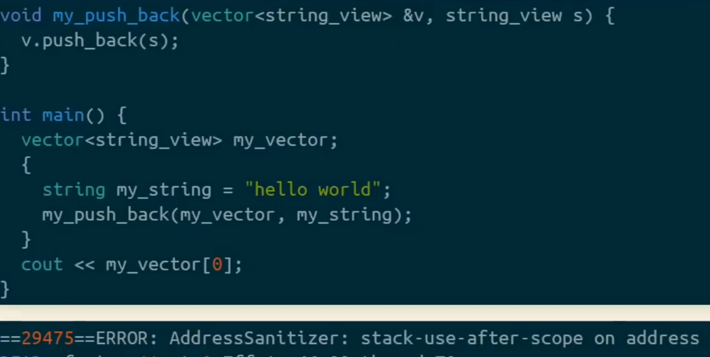

#### An invalid caller

To fix previous lifetime error (and move the error from `fn my_push_back` to main).

We need `explicit` lifetime anotations.

```rust
fn my_push_back<'a>(v: &mut Vec<&'a str>, s: &'a str){
   v. push (s);
}
```

- Now we stated that `&'a str` lives at least as long as Vec v and has the same lifetime `'a`.

- And we get the next error which is now moved to `fn main`

```markdown
my_push_back(&mut my_vector, &my_string);
                              ^^^^^^^^^ borrowed value does not live long enough

- `my_string` dropped after we exited {} scope and is no 
```

- These types of lifetime errors are common when you're imlpementing Iterator on the types.

- [More on lifetimes - 30min code examples](https://www.youtube.com/watch?v=WgXV_0HiwOc)

---

### Mutable references are always unique. No mutable aliasing.

#### Mutable aliasing

```rust
let mut my_int = 5;
let reference1 = &mut my_int;
let reference2 = &mut my_int;
*reference1 += 1;
*reference2 += 1; assert_eq! (my_int, 7);
```

- Compiler Error: Cannot borrow `my_int` as mutable more than once at a time.

- Here rust starts to feel more restrictive than C++.

- In C++ you may very well do this just fine.
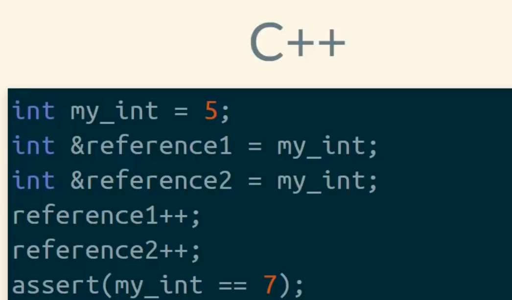

- This is as a result of Rust trying to **KEEP References ALWAYS VALID** </br>
By trusting us that we can only mutate &mut exclusive ref from only one place.

#### Multiple references into array

```rust
let mut char_array: [char; 2] = ['a', 'b'];
let first_element = &mut char_array[0];
let second_element = &char_array[1];
*first_element = *second_element;
assert_eq! (char_array[0], 'b');
```

- Compiler Error: cannot borrow `char_array []` as immutable because it is also borrowed as mutable

- You can't have both mutable ref `&mut` and shared ref `&` to the same object at the same time. (we can't ensure **ALWAYS VALID REFERENCES** this way)

- Rust sees the borows as the borrows of the whole array (doesn't matter that we only index into it)

- C++ equivalent code is perfectly valid code that compiles.
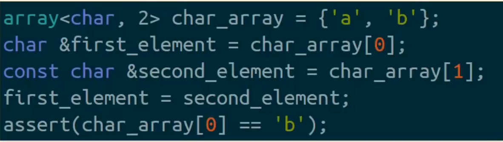

#### Few options to solve this double ref issue

- just use indexes
- pattern matching
- split_at_mut
- iter_mut
- `Cell<char>`
- `RefCell<char>` (escape hatch into borrowing and aliasing rules)
- unsafe code

split_at_mut() example

```rust
let mut char_array: [char; 2] = ['a', 'b'];
let (first_slice, rest_slice) = char_array.split_at_mut(1);
let first_element = &mut first_slice[0];
let second_element = &rest_slice[0];
*first_element = *second_element;
assert_eq! (char_array[0], 'b');
```

- Usually the solution is to just use `indexes` into a container (collection) instead of references, but there is more options too.

- `split_at_mut` guarantees to the compiler that indexes on the left and the right do not overlap. Thus mutable aliasing does not occur and you're able to index them separately.

unsafe block

- casts `&mut` and `&` into raw pointers `*mut` and `*const`
- with that we lose rust lifetime and aliasing guarantees, thus we have to use `unsafe` block to be able to `deref` into those values behind raw pointers.

```rust
let mut char_array: [char; 2] = ['a', 'b'];
let first_element: *mut char = &mut char_array[0];
let second_element: *const char = &char_array[1];
unsafe {
   *first_element = *second_element;
}
assert_eq! (char_array[0], 'b');
```

- We do mostly use unsafe when interfacing with `C` libraries or when implementin datastructures (we usually wrap those Api's in safe interface for end user to use)

### Aliasing C++ vs Rust

Because C++ reference aliasing is allowed vs not allowed in rust we get this extra operation `mov     dword ptr [rsi], 42` in C++ vs rust. Compiler in C++ has to be defensive because of the 2 ref aliasing potential.

[Godbolt c++ vs Rust](https://godbolt.org/z/891s6z4Tb)

#### Invalidating a reference by reallocating

```rust
fn push_int_twice(v: &mut Vec<i32>, n: &i32) {
   v. push(*n);
   v. push (*n);
}
fn main () {
   let mut my_vector = vec! [0];
   let my_int_reference = &my_vector [0];
   push_int_twice(&mut my_vector, my_int_reference);
}
```

Compiler Error

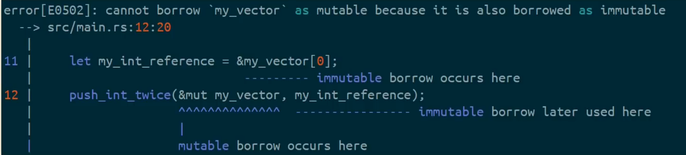

- Here `no mutable aliasing` prevents Undefinded behaviour. (and error is in the caller instead of the function signature as it was before)

- Here `n` is aliasing into `v` 
- Where we reference into a container where that reference has been `mutated` and is no longer valid.

- C++ Error
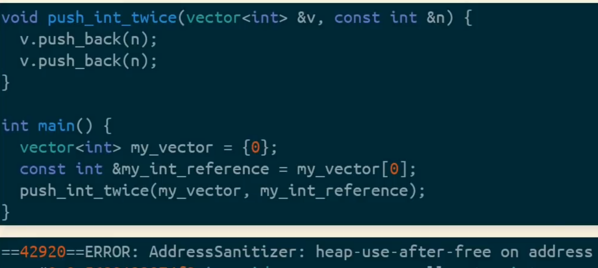

- No mutable aliasing rule is also mentioned int his C++ talk 
[CpCon 2014 Herb Sutter](https://www.youtube.com/watch?v=xnqTKD8uD64&t=1380s)

</br>

#### Multithreading

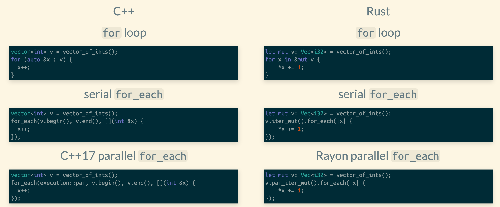

#### Invalid multithreading 

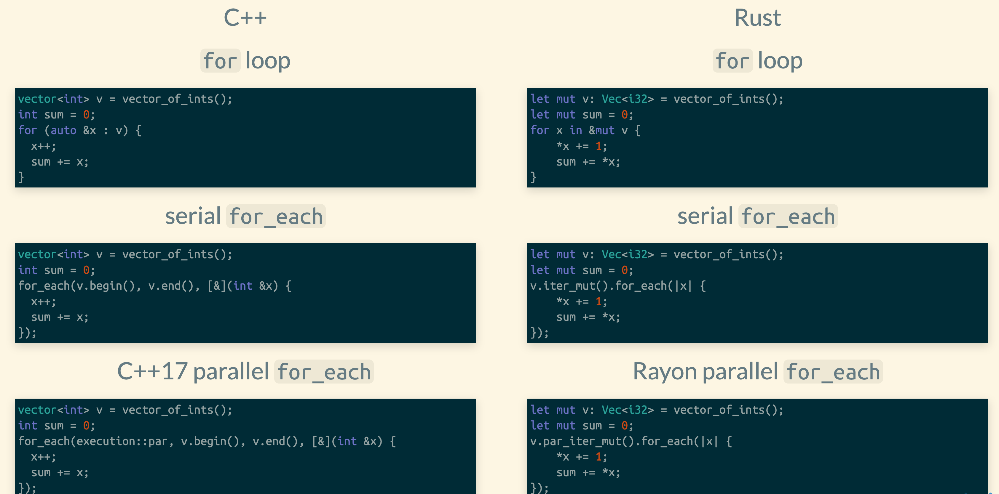

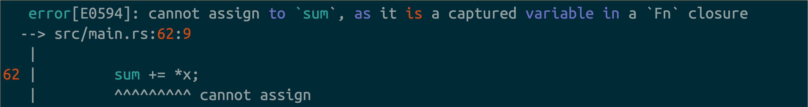

- Rust error says that we're not allowed to hold any references to the parent scope since we will have data races in between threads updating its value.

Rust knows to throw this error by looking at the `method signatures`

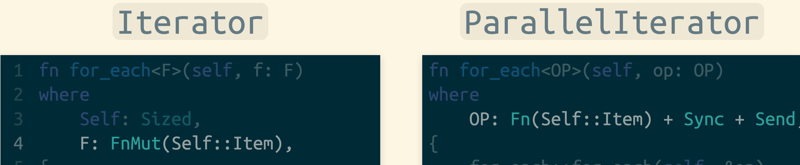

- std lib accepts `FnMut` were it's allowed to hold mutable ref to outside scope.
- parallel version can only hold shared ref to outside scope `Fn` 


#### Correctly synchronizing shared state

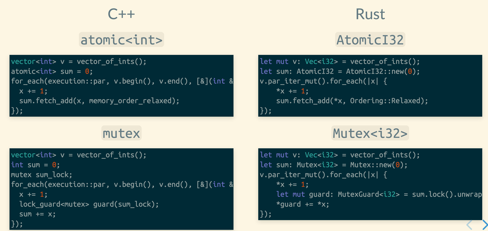

- If we're working with any other type than Int , we reach for Mutex.

- Murtx is a ***container** type in rust.
- We access the int through the guard .
- `MutexGuard` is a smart pointer.

---

### 3 Move semantics

- Plain old data (POD) types like `i32` and `&T` are Copy.

- By-value operations (like assignment, parameter passing, and returning) on `Copy` types are `bitwise copies`, like in C. Other types like `Vec<i32>` and `&mut T` are non-Copy.
(&mut T must respect no mutable aliasing rule - thus they are not copy reguardless of their lifetimes.)

- By-value operations on non-Copy types are moves. Moves are **destructive bitwise copies**, and everything is movable.
(When you pass a non `Copy` struct to a `fn` by value , that is bitwise copy (move) )
We **never even invoke the destructor** on the `moved` objects. (it's gone imediately)

- So. If Type is `non Copy` type , the move is destructive.

#### Moving a string (C++ vs Rust)

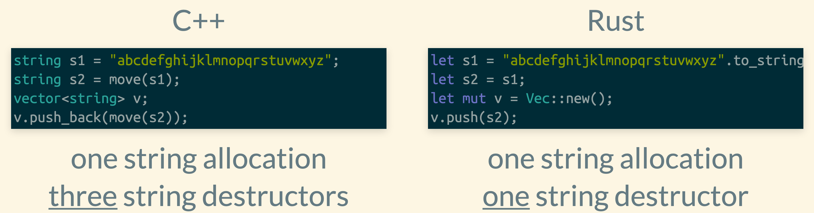

#### Copying a string (C++ vs Rust)

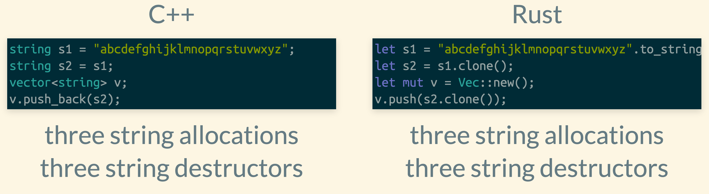

#### Acessing a moved-from object (C++ vs Rust)

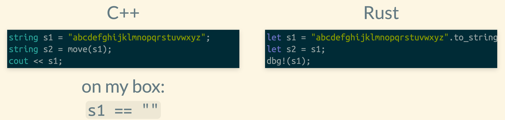

- In rust you can't do that (the moved value is no longer available). ERROR: `use of moved value: 's1'`

#### Moving a borrowed object (C++ vs Rust)

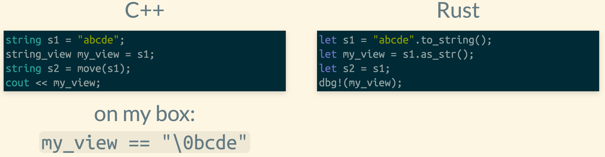

- In rust you can't do that (the moved value is no longer available). ERROR: `cannot move out of 's1' because it is 'borrowed' object`

- C++ works because of 'small string optimization' and stack alocation / ASAN and UBSAN don't complain in this case.

#### Moving string again

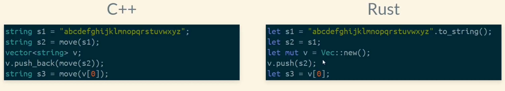

- ERROR: `cannot move out of index of Vec<String>  -> let s3 = v[0]` (move occurs because value has type `String`, which does not implement the `Copy` trait.  </br> Help: consider borrowing here: `&v[0]`)

- This is effectively trying to `move` from behind of mutable reference. (Vec) Which you cannot do in Rust.

- the difference is that in Rust when you `move` out of something it's no longer a valid state. In C++ it is . (We would have to tel Vec to never `destruct` the element in it)

Here is a similar case.

#### Moving through a reference

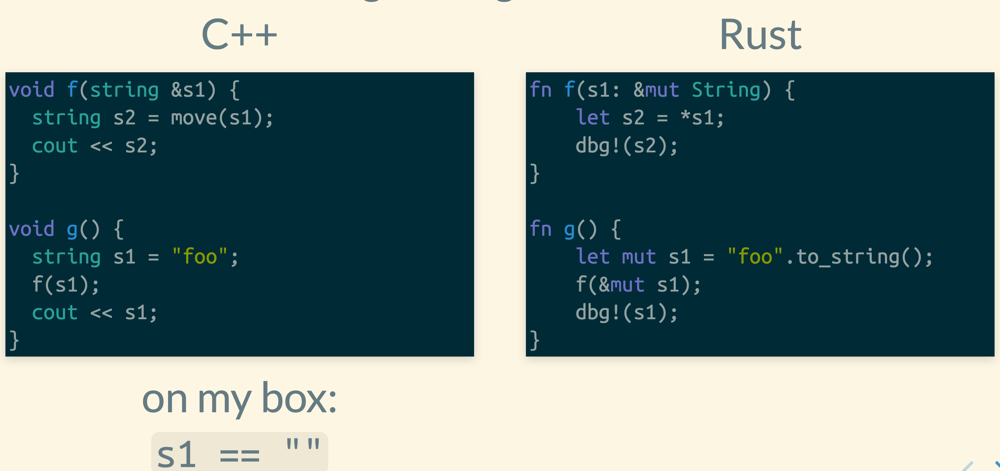

- We moved the `*s1` inside of the `fn f()` body to `let s2` , leaving `fn g()` in undefined state when working with `mut s1` after the call to `fn f()`.

#### There are ways to work aroud that

mem::swap

```rust
fn f(s1: &mut String) {
    let mut s2 = "".to_string();
    mem::swap(s1, &mut s2);
    dbg!(s2);
}

fn g() {
    let mut s1 = "foo".to_string();
    f(&mut s1);
    dbg!(s1);
}
```

- `s1 == ""` , `s2 == "foo"` (Cheap swap where string "" won't even allocate memory)

Option::take

```rust
fn f(s1: &mut Option<String>) {
    let s2 = s1.take().unwrap();
    dbg!(s2);
}

fn g() {
    let mut s1: Option<String> =
        Some("foo".to_string());
    f(&mut s1);
    dbg!(s1);
}
```

- `s1 == None` , `s2 == "foo"` (Optional types can be left in the None state)

Vec::remove

```rust
fn f(v: &mut Vec<String>) {
    let s2 = v.remove(0);
    dbg!(s2);
}

fn g() {
    let mut v = vec![
        "foo".to_string(),
        "bar".to_string(),
        "baz".to_string(),
    ];
    f(&mut v);
    dbg!(v);
}
```

- `v == ["bar", "baz"]` , `s2 == "foo"` (Vec supports shifting operation, where we  'pop front')</br>
But this won't be done implicitely for you, just by indexing ...

#### Drop fn

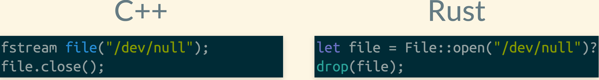

- Destroy object immediately

- [Docs](https://doc.rust-lang.org/std/ops/trait.Drop.html#tymethod.drop) , [Rust by example](https://doc.rust-lang.org/rust-by-example/trait/drop.html)

Std lib shows how drop works ...

```rust
pub fn drop<T>(_x: T) {} //anything moved here gets immediately droped
```

1. moves passed type `T` into the `fn drop`
2. destroys at the end of scope = immediately since it's an empty function.


#### Rust implementation notes

- because of **move semantcs** Rust has to heap allocate Mutex on `unix /linux`
- small string optimization is not possible in rust because it **can't have circular pointer inside of struct** do to mutable move semantics.
- because of the assumption **all types are movable, and moves are infallable** Rust compiler can infer `memmove@GOTOPARCEL` single opration when removing from Vec for example

#### A mutex on the stack

Following rust code doen't compile

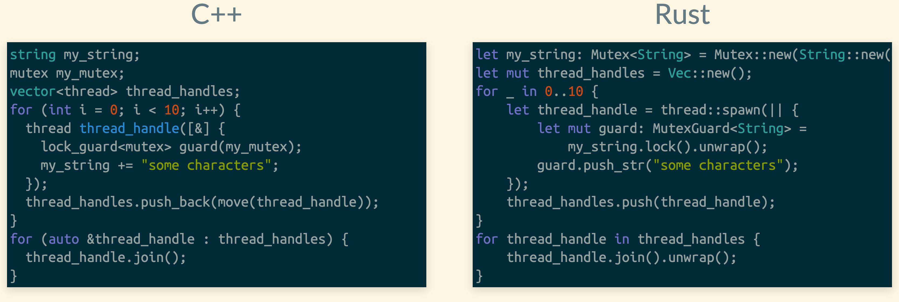

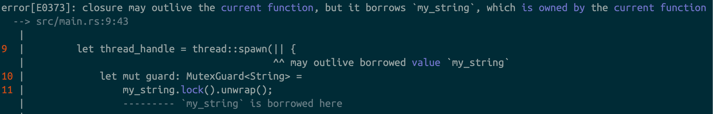

- Its all because of the function definition ... 

- It says you're not allowed to give me **closures that borrow things** (any borrows)

- Spawning a thread can also fail, and than we would have `use after free` on the Mutex , so rust is right to comlain here. 

#### A mutex on the heap

Arc is Rust's `shared_ptr` from C++

- You can't borrow contents of Arc dirretly as mutable.

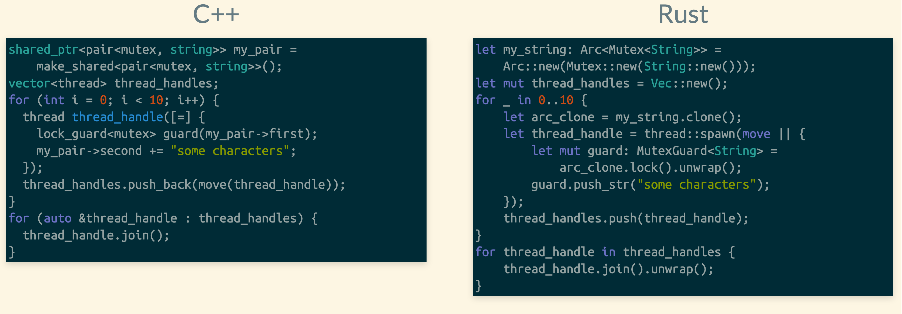

This is now vald rust code, that satisfies fn signature with moved ownership into it.

#### RwLock

is similar to Arc in a way that it **DOESN'T implement** `DerefMut`

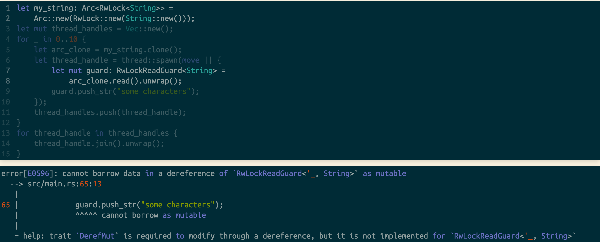

---

Inapired by this great talk by: `Jack OConnor` i made this reminder of the core rust principles for myself. (with some extra notes)

Follow jack, he's Great!

- [AFirehoseOfRust - Short 1.5hr Talk - Jack](https://www.youtube.com/watch?v=IPmRDS0OSxM)
( [2.5Hr Version](https://www.youtube.com/watch?v=FSyfZVuD32Y) )

- [Slides - AFirehoseOfRust - Jack](https://jacko.io/firehose_of_rust)

</br>

By `Dominik Polzer`
